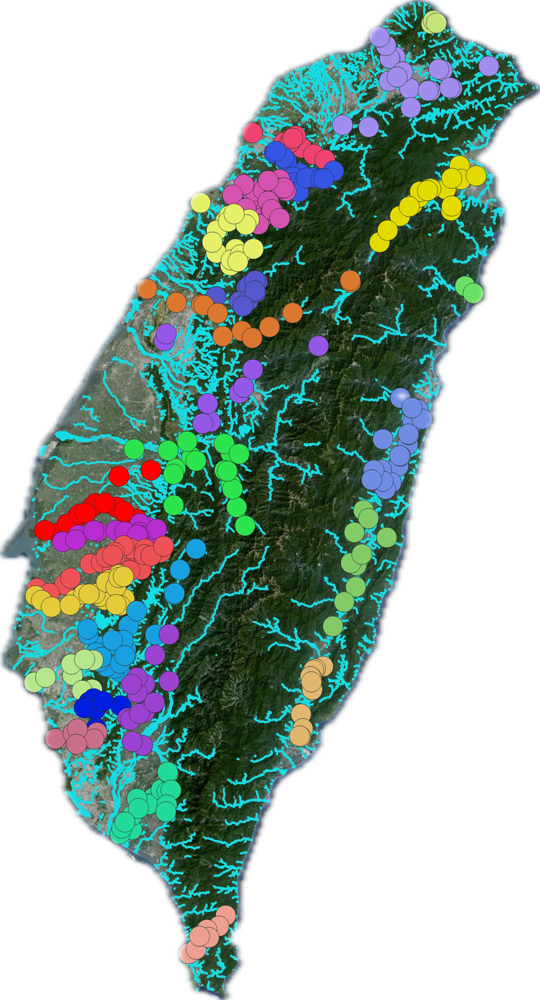

```{r global, include=FALSE}
##### set up #####
library(shiny)
library(sf)
library(ggplot2)
library(writexl)
library(dplyr)
library(shadowtext)
library(flexdashboard)

d <- -40
l <- -530

##### 載入地圖資料 #####
load("Incidence_data.RData")
load("map.RData")
shp <- taiwanmap[c(3, 5)]  #臺灣地圖

###### 將結果印出來(圖片、樣站) #####
map_plot_result <- function(data, river_no) {
  
  id <- list()
  
  for(i in river_no) {
    id[[i]] <- match(data[[i]], data_l$locationID)
  }
  
  all_id <- unlist(id)
  data_loc <- data_l[all_id,]  
  data_loc <- na.omit(data_loc)
  
  data_loc$BA_NO <- substr(data_loc$locationID, 1, 4)
  merged_data <- merge(data_loc, rv3, by.x = "BA_NO", by.y = "BA_NO")
  
  return(merged_data)
}
```

```{css echo = FALSE}
/* styles.css */
body {
    display: flex;
    justify-content: center;
    align-items: center;
    width: 100%;
    height: 100%;
    position: relative; /* 設置父元素為相對定位 */
}

.sidebar {
  width: 500px !important;
  overflow-x: auto; /* 允許水平滾動 */
}

.tabset{
  width: 950px !important;
  height: 800px; /* 與.sidebar 相同高度 */
  position: absolute; /* 將.tabset設置為絕對定位 */
  right: 0; /* 將.tabset貼齊右邊 */
}

  img {
  max-width: 90%;
  height: auto;
}
```

Column {.sidebar}
-------------------------------------
    
### 種類選擇
```{r}
selectInput("category", label = "種類", 
            choices = list("魚類" = 1, "蝦蟹類" = 2, "昆蟲類" = 3,
                           "螺貝類" = 4, "環節動物" = 5, "藻類" = 6,
                           "植物" = 7, "哺乳類" = 8, "鳥類" = 9,
                           "爬蟲類" = 10, "兩棲類" = 11),
            selected = 1)


```




Column {.tabset}
-------------------------------------
### Summary

```{r}
```


-------------------------------------
### Plot

```{r}
titlePanel({

      tags$div(

        style = "text-align: center; font-weight: bold; position: relative; z-index: 9999;
        text-shadow: 1px 1px 2px #000;color: Black",
        HTML("<span style='font-size: 80%; font-weight: bold;'>特有生物中心</span>"),
        br(),
        HTML("<span style='font-weight: bold; font-size: 120%;'>河川情勢調查</span>")
      )

    })

tags$div(class = "result",
        absolutePanel(id = "button_panel",
                      draggable = F,  
                      top = 10,         
                      left = l + 550,        
                      width = 700,       
                      height = 495.6,       
                       uiOutput("river_info")
                        )
                             )
```